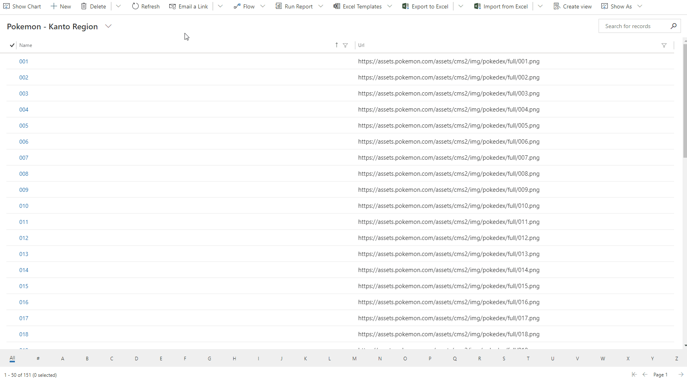

# URL Image List Control

## Overview

URL Image List Control allows showing the list of records with the image that is stored as URL in a single line of text field.

## Download

## Configuration

| Field | Description                             |
| ----- | --------------------------------------- |
| Name  | Text that will be displayed on the list |
| URL   | URL of the image you want to show       |

## Preview

## Features

- Show list of records as images with text on the bottom